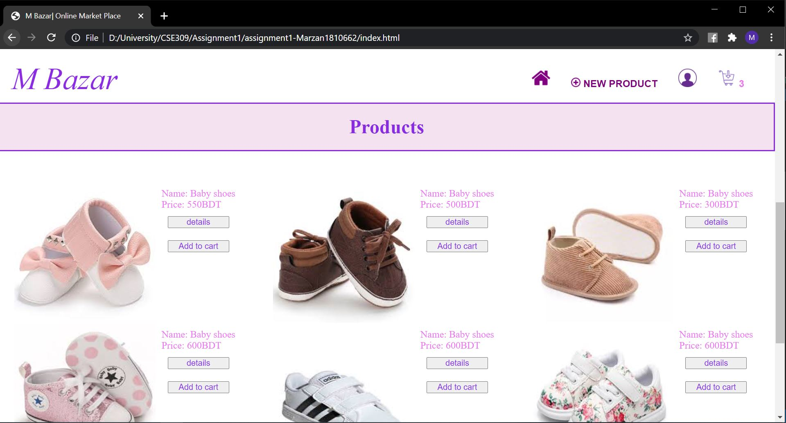
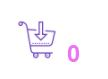
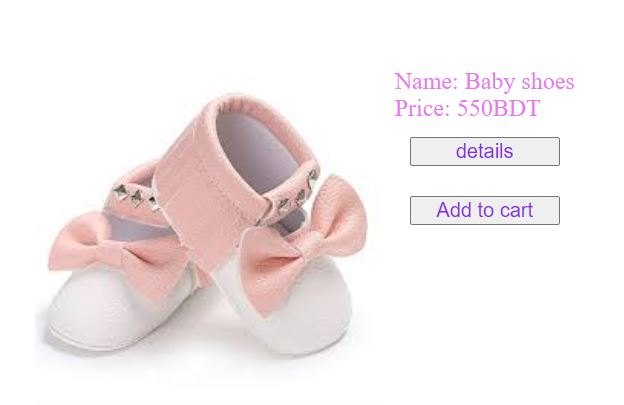
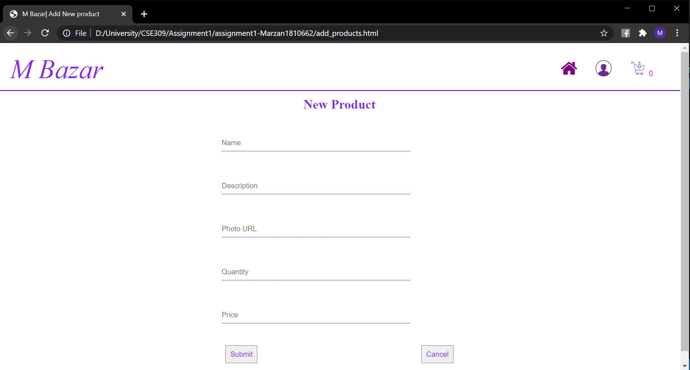
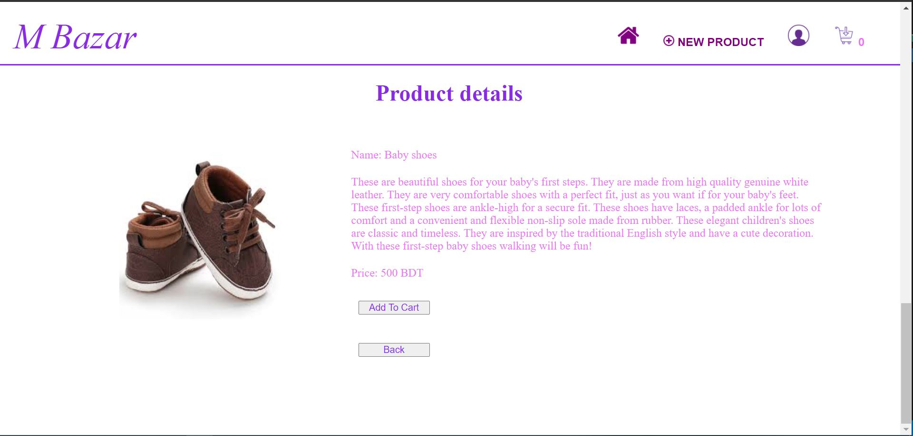
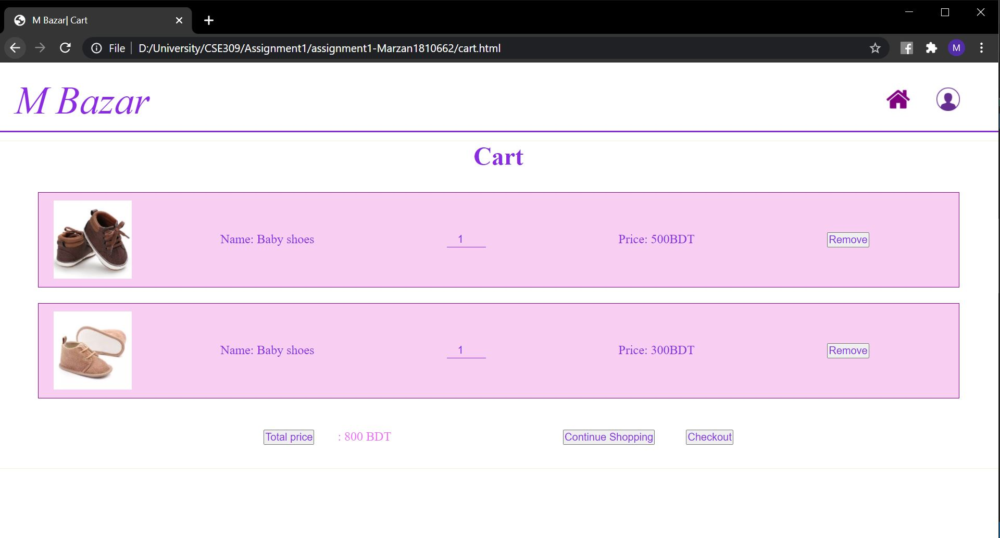
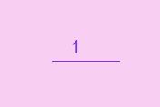
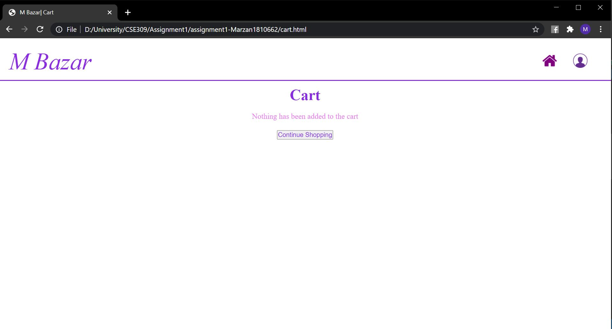

# Assignment1
1. Home Page

    -On the first page there are information about the page and information about new features.
    -On the navigation bar there is manu bar containing home, add new product, account and cart icon

2.All products view- Home page

  
     - "new product" icon in the navigation bar shows 'New product form view'
      
     -"acart" icon in the nevigation bar shows the number of items in the list and it load the cart page.
     
     -reloads the home page

 
    - beside every product there are two buttons
    -"details" button shows 'Single product view'
    -"Add to cart" button adds products in cart and shows updated number of items in the cart on the menu bar cart icon. 

3.New product form view

    -in the input fields, various information about the product are put
    - "submit" button adds product to the home page with the input form information
    -"cancel" button reloads the page

4.Single product view (product details)

    - "back button" on single product view page loads the home page
    -"add to cart button" adds the product in cart

4.Shopping cart View with items

    -shows the cart view with products
    
    - each product quantity can be changed 
    -"total" button updates the total price
    -"remove button" removes each corresponding product from cart
    -"Continue shopping" button loads the home page

5.Empty card view

    -empty card view shows the messege "nothing has been added to the cart"
    -"continue shopping" loads the home page
