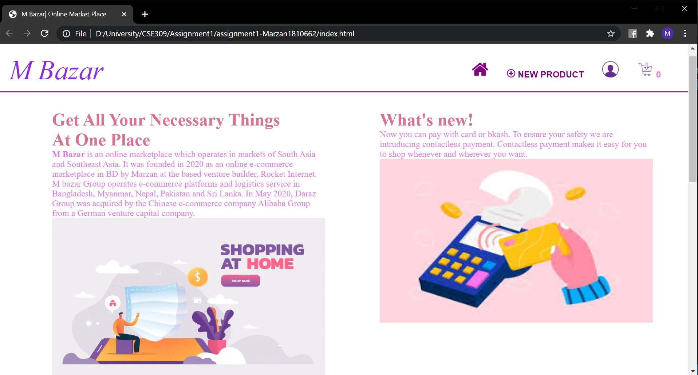

# Assignment1
1.All products view- Home Page
<<<<<<< HEAD

=======

>>>>>>> 3084b16680d8b077c44ba7ef1c2118ed62d6d01c
    - "new product" in the navigation bar shows 'New product form view'
    -"add to cart" button beside each product adds product to cart
    -"details" button shows the single product view of each product
2.New product form view

    - "submit" button adds product to the home page with the input form information

3.Single product view (product details)

    - "back button" on single product view page loads the home page
4.Shopping cart View with items

    - each product quantity can be changed
    -"remove button" removes each corresponding product from cart
    -"Continue shopping" button loads the home page
5.Empty card view

    -empty card view shows the messege "nothing has been added to the cart"
    -"contimue shopping" loads the home page
